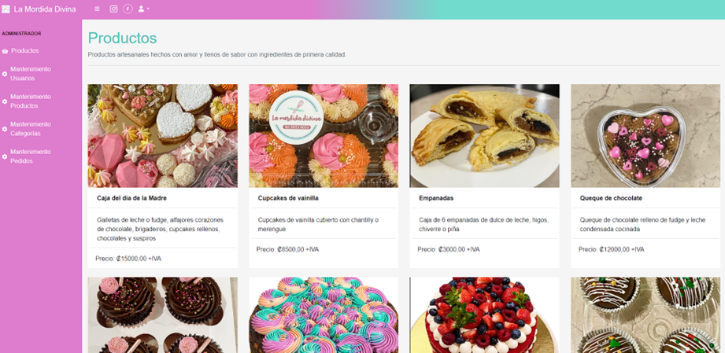
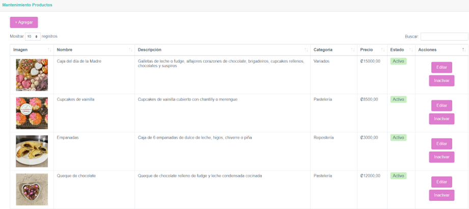
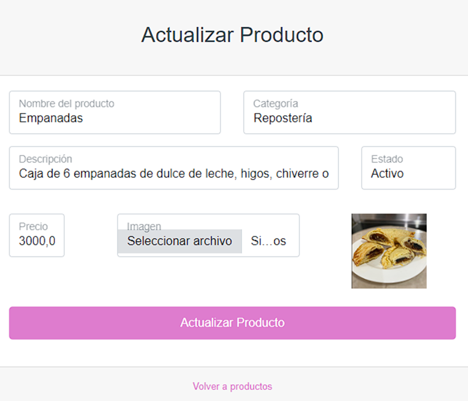
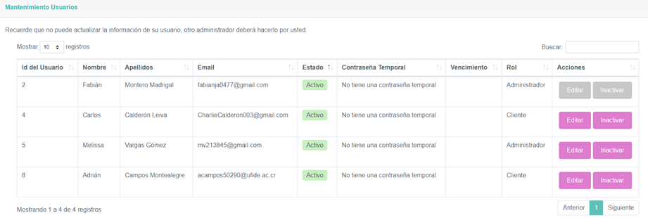
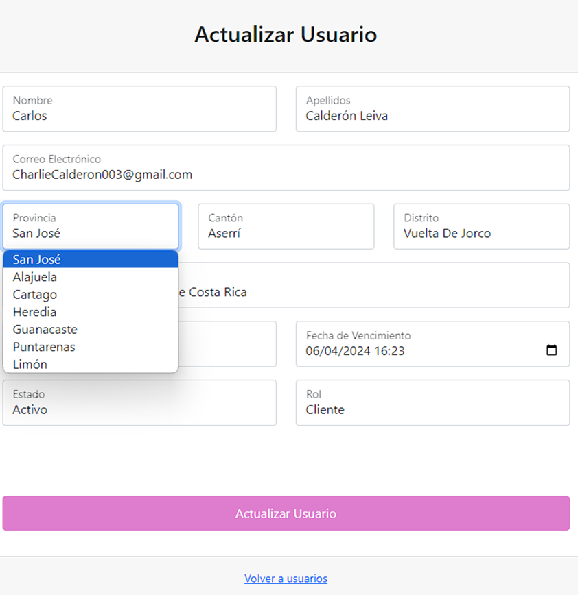
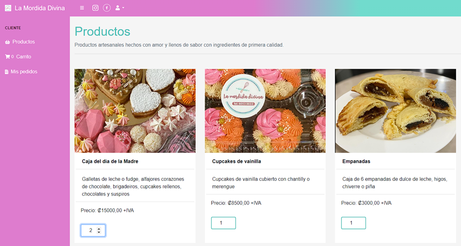
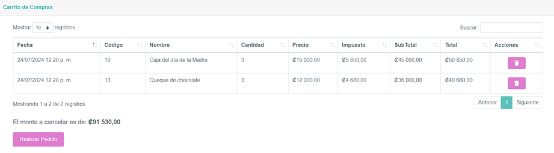
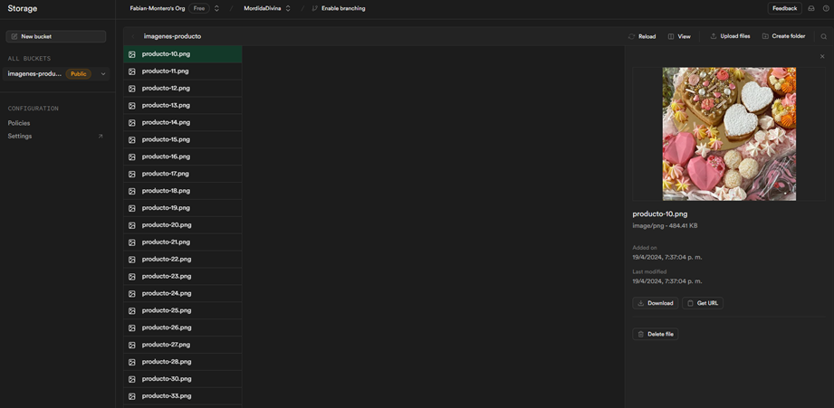

## Mordida Divina - Bakery App

### Technologies
-	C#
-	.NET Framework
-	Entity Framework
-	SQL Server
-	Supabase

### Description
University project for a bakery, where customers can select products to purchase, simulate a shopping cart, and view their order history. On the administrator side, there are maintenance views for products, users, categories, orders, etc.

-	Implemented image usage through Supabase
-	Consumed an external API for user address registration
-	Used the MVC pattern
-	Web project using Razor
-	API project using Entity Framework and stored procedures

### Run project

-	Clone repository
-	Run the database script in SQL Server Management Studio
-	Generate the Entity Framework model in the API project (EF Designer from database), referencing the local database connection
-	Add the email and password in the app settings to send emails 
-	Load dependencies, clean and compile project

### Images

